# nacos服务发现


## http远程调用

原先的远程http请求调用代码:

```java
 Set<Long> itemIds = vos.stream().map(CartVO::getItemId).collect(Collectors.toSet());
        // 2.查询商品
        //利用RestTemplate发起http请求，得到http的响应
        ResponseEntity<List<ItemDTO>> response = restTemplate.exchange(
                "http://localhost:8081/items?ids={ids}",
                HttpMethod.GET,
                null,
                new ParameterizedTypeReference<List<ItemDTO>>() {},
                Map.of("ids", CollUtil.join(itemIds, ","))
        );
        //这里的http请求使用的是硬编码，之后万一有更多的购物车服务的话，
        // 此处无法完成服务的正常使用，此时就需要使用到注册中心！！
        //解析响应
        if(!response.getStatusCode().is2xxSuccessful()){
            //查询失败，直接结束
            return;
        }
        List<ItemDTO> items = response.getBody();
        if (CollUtils.isEmpty(items)) {
            return;
        }
```

## Nacos服务发现

利用nacos服务发现新代码：

```java
 // 1.获取商品id
        Set<Long> itemIds = vos.stream().map(CartVO::getItemId).collect(Collectors.toSet());
        //1.根据服务名称获取服务实例列表
        List<ServiceInstance> instances = discoveryClient.getInstances("item-service");
        if (CollUtils.isEmpty(instances)){
            return;
        }
        //2.负载均衡，从实例列表中挑选一个实例
        ServiceInstance serviceInstance = instances.get(RandomUtil.randomInt(instances.size()));
        //3.利用RestTemplate发起Http请求，得到http响应
        ResponseEntity<List<ItemDTO>> response = restTemplate.exchange(
                serviceInstance.getUri()+"items?ids={ids}",
                HttpMethod.GET,
                null,
                new ParameterizedTypeReference<List<ItemDTO>>() {},
                Map.of("ids", CollUtil.join(itemIds, ","))
        );
        if(!response.getStatusCode().is2xxSuccessful()){
            //查询失败，直接结束
            return;
        }
        List<ItemDTO> items = response.getBody();
        if (CollUtils.isEmpty(items)) {
            return;
        }
```

****

# OpenFeign


由于服务发现中的Http代码较多，使用nacos和之前没有进行服务拆分的代码相比代码复杂了很多。

## 简介


原本的代码的主要功能：


## 入门

 


1.

2.

3.

4.

## 连接池优化


开启步骤


## Feign最佳实践

在添加商品到购物车中的功能中需要使用到查询商品功能，当时定义了一个OpenFeign的接口，在订单创建时也会使用到查询商品功能，就还需要再重复的定义一个查询商品的OpenFeign接口吗？


此时有了代码的重复的问题，后续还需要重复修改

方案一：


项目结构复杂。

方案二：


耦合度比较高。

这里演示第二种

CartApplication启动类所在的包是spring自动扫描的地方(com.ym.cart)，所以尽管pom中添加了client的依赖，但是spring无法创建client的实例，因为扫描的范围只有启动类所在的位置。

注意:

> 

## 日志输出


# 网关

拆分微服务带来的问题：

> 1.服务地址过多，而且后期可能发生变化，前端不知道访问谁;
>
> 2.每个服务都需要登录信息，如果每个服务中添加的话就会导致代码冗余;

解决方案：
网关：是网络的关口，负责请求的路由，转发，身份校验 

使用的是springcloud的 spring cloud gateway

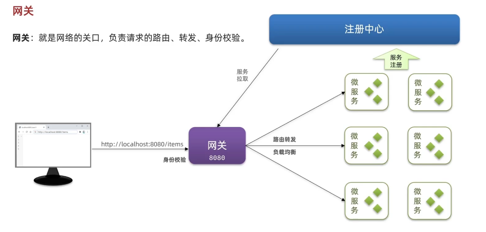

微服务的地址不需要暴露给前端，只需要将网关的地址提供就可以。

## 入门

>1.创建新模块
>
>2.引入网关依赖
>
>3.编写启动类
>
>4.配置路由规则


## 路由属性

路由断言


路由过滤器


例子：添加请求头过滤器

```F#
    gateway:
      routes:
        - id: item # 路由规则id，自定义，唯一
          uri: lb://item-service # 路由的目标服务，lb代表负载均衡，会从注册中心拉取服务列表
          predicates: # 路由断言，判断当前请求是否符合当前规则，符合则路由到目标服务
            - Path=/items/**,/search/** # 这里是以请求路径作为判断规则
          filters:
            - AddRequestHeader= truth, anyone long-press like button will rich
```

```java
    @ApiOperation("分页查询商品")
    @GetMapping("/page")
    public PageDTO<ItemDTO> queryItemByPage(PageQuery query,@RequestHeader(value = "truth" , required = false)String truth) {
        System.out.println(truth);
        // 1.分页查询
        Page<Item> result = itemService.page(query.toMpPage("update_time", false));
        // 2.封装并返回
        return PageDTO.of(result, ItemDTO.class);
    }
```


控制台将添加的请求头打印，如果需要每个路由都生效该过滤器，则将该过滤器添加到route同级的标签下

```javascript
spring:
  application:
    name: gateway
  cloud:
    nacos:
      server-addr: 192.168.237.128:8848
    gateway:
      routes(5):
      default-filters:
        - AddRequestHeader= truth, anyone long-press like button will rich
```

## 登录校验功能

​	首先登录授权微服务通过jwt的方式将用户的token保存到前端，别的微服务如订单和购物车都需要获取该token，不希望将jwt秘钥传递给这些微服务，现在通过网关来进行登录校验！向后传递登录token。

 网关处理流程：


1.在nettyroutingfilter过滤器执行前，定义一个执行优先级高的自定义的过滤器(pre阶段)，将登录校验放在此处；

2.由于网关和其他微服务都是服务，部署在不同的tomcat上，所以不能使用ThreadLocal这个在同一个tomcat不同线程之间共享信息的方式。所以此时将信息放在请求头中传递；

3.微服务之间传递用户信息，也是保存在请求头中;

区别:网关-->网关内置的一种http请求

​		微服务之间-->OpenFeign传递

### 自定义过滤器 (GloableFilter)

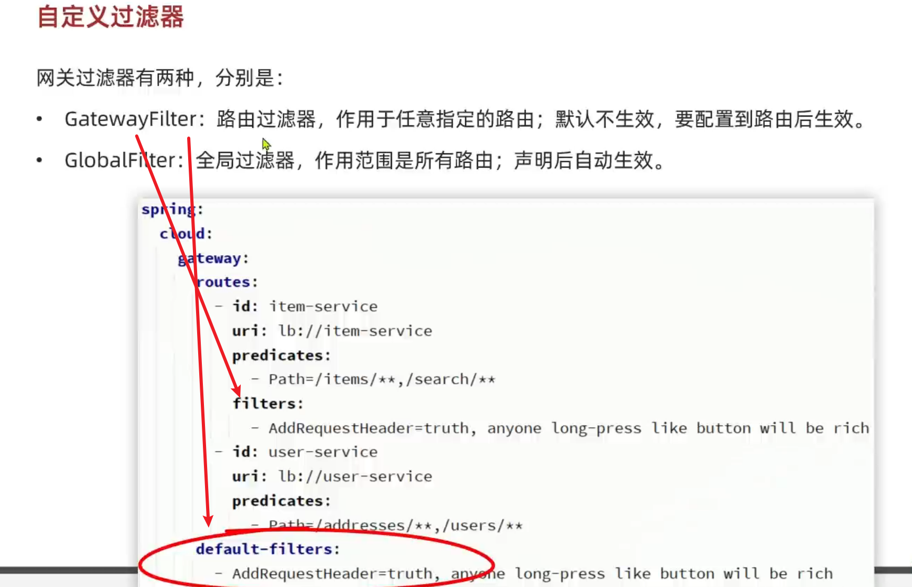

在配置文件中设置的filter和default-filter就是gatewayfilter，配置灵活。

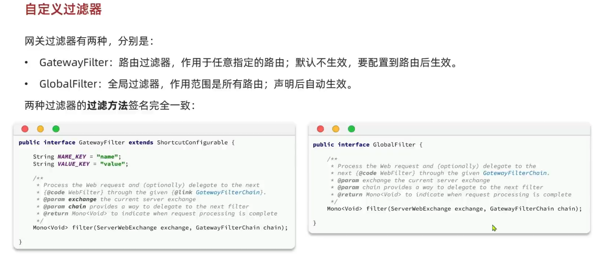

​	将自定义过滤器作为判断用户身份的功能，并且保证该过滤器在NettyRoutingFilter之前执行，就能确保在转发路由请求前登录校验。

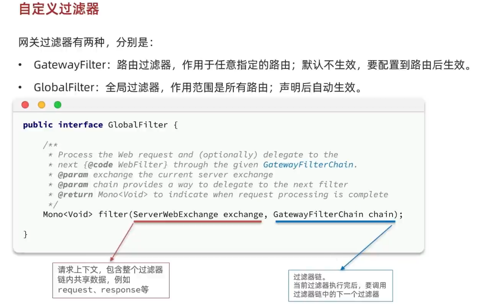

1.创建自己的过滤器

```java
@Component
public class MyGlobalFilter  implements GlobalFilter{
    @Override
    public Mono<Void> filter(ServerWebExchange exchange, GatewayFilterChain chain) {
        //TODO 模拟登录校验逻辑
        ServerHttpRequest request = exchange.getRequest();
        HttpHeaders headers = request.getHeaders();
        System.out.println("headers"+headers);
        //放行
        return chain.filter(exchange);
    }
}
```

2.设置过滤器优先级

```SAS
通过实现的Ordered的类的getOrder方法，该方法返回的数字越小，优先级越大，如 NettyRoutingFilter的优先级为：
```


在debug模式下先进入了Gloable中：


### 自定义过滤器(GatewayFilter)


此处跳过

### 实现登录校验（GloableFilter）

需求：在网关中基于过滤器实现登录校验功能

```
通过继承GloableFilter，Ordered实现，AuthLoginGloableFilter
代码:AuthLoginGloableFilter.java
```

### 实现登录用户信息传递功能

```
//todo 传递用户信息
String userInfo = userid.toString();
exchange.mutate()
        .request(builder->builder.header("user-info",userInfo))
        .build();
```


注意需要传递给下一个过滤器。

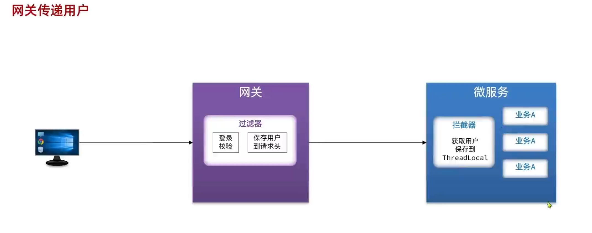

### 将保存用户信息功能放入hm-common中

由于每个微服务都有可能有获取登录用户的需求，所以将该功能定义在common模块中，就不用在每个微服务的controller中去来判断user是否有登录信息。

拦截器定义：

```java
public class UserInfoInterceptor implements HandlerInterceptor {
    //该拦截器不做任何的登录拦截功能，唯一的作用就是保存登录成功的user用户信息

    @Override
    public boolean preHandle(HttpServletRequest request, HttpServletResponse response, Object handler) throws Exception {
        //在进入controller前执行，所以他的作用是保存用户信息
        //1.获取登录用户信息
        String header = request.getHeader("user-info");
        //2.判断是否获取了用户，存入ThreadLocal
        if (StrUtil.isNotBlank(header)) {
            UserContext.setUser(Long.valueOf(header));
        }
        //3.放行
            return true;
    }

    @Override
    public void afterCompletion(HttpServletRequest request, HttpServletResponse response, Object handler, Exception ex) throws Exception {
        //controller之后执行，清理用户信息
        UserContext.removeUser();

    }}
```

拦截器配置，将其生效

```java
@Configuration
public class MvcConfig implements WebMvcConfigurer {
    @Override
    public void addInterceptors(InterceptorRegistry registry) {
        //此处不添加任何 拦截path，表示不做任何的拦截
        registry.addInterceptor(new UserInfoInterceptor());
    }
}
注意：此时该配置类无法被spring扫描到！！！，因为项目中的各种微服务都不会扫描commnon中的配置类
```

需要再下面的配置文件中，将配置类添加进去，保证项目启动时，该配置类被spring扫描到;

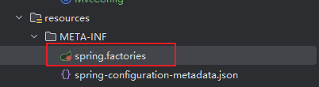

```xml
org.springframework.boot.autoconfigure.EnableAutoConfiguration=\
  com.hmall.common.config.MyBatisConfig,\
  com.hmall.common.config.MvcConfig,\
  com.hmall.common.config.JsonConfig
```

但是此时重新启动gateway还是会报错：

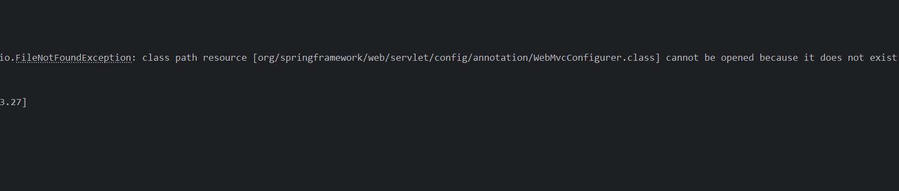

网关部分代码报错，WebMvcconfigurer找不到？

​	是因为Gateway中pom.xml引用了hm-common的依赖，而WebMvcConfigurer是springmvc包下的，但是网关gateway的底层不是基于springmvc的一套，所以里面没有springmvc，所以报错了。

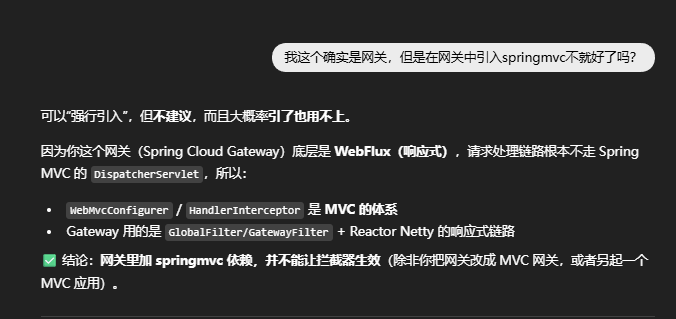

解决方法：

让common在微服务中生效，在网关中不生效，利用网关中没有springmvc的特性,条件注解

```java
@Configuration
@ConditionalOnClass(DispatcherServlet.class)
/*ConditionalOnClass 该注解的作用是，如果该环境下没有springmvc的核心类DispatcherServlet的话
* 就不会自动将该MvcConfig加载，主要的作用是网关(没有springmvc)部分需要加载该类(有springmvc)*/
public class MvcConfig  implements WebMvcConfigurer {
    @Override
    public void addInterceptors(InterceptorRegistry registry) {
        //该拦截器不会拦截任何请求，只是为了传递Userinfo对象
        registry.addInterceptor(new UserInfoInterceptor());
    }
}
```

### OpneFeign传递用户

微服务之间的项目调用，也需要传递用户的信息：在创建订单后，需要清空购物车中的商品：

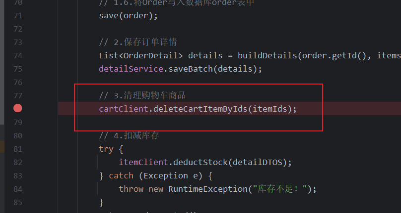

会使用OpenFeign调用cart微服务中的业务逻辑：

```java
@FeignClient("cart-service")
public interface CartClient {
    @DeleteMapping("/carts")
    void  deleteCartItemByIds(@RequestParam("ids") Collection<Long> ids);
}
```

由于不是从网关中传递过来的请求，导致UserContext中没有保存下用户的信息

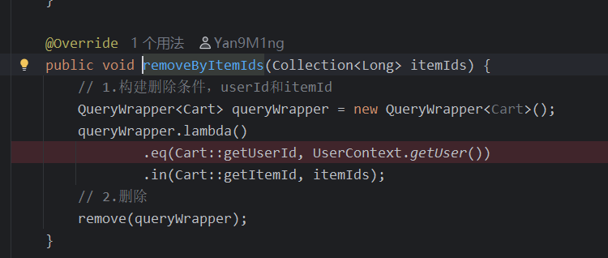

此处就用到了 OpenFeign的：

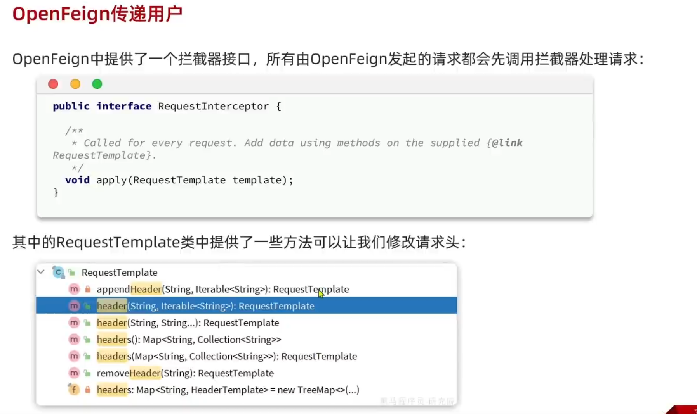

```java
//通过拦截器 来传递user的登录信息
public class DefaultFeignConfig {
        @Bean
        public Logger.Level feignLoggerLevel(){
            return Logger.Level.FULL;
        }
        @Bean
        public RequestInterceptor userInterceptor(){
            return new RequestInterceptor() {
                @Override
                public void apply(RequestTemplate requestTemplate){
                    Long UserId =UserContext.getUser();
                    if(UserId!=null){
                        requestTemplate.header("user-info", UserId.toString());
                    }
                }
            };
        }
}
```

注意：

此处的这个拦截器是OpenFeign的拦截器，作用是传递用户信息；请求从网关中先进入trade微服务，此时请求头中带着用户信息，然后trade向carts发送请求时，上面的拦截器就会生效(如果没有上面的拦截器，就会导致用户信息不存在)。

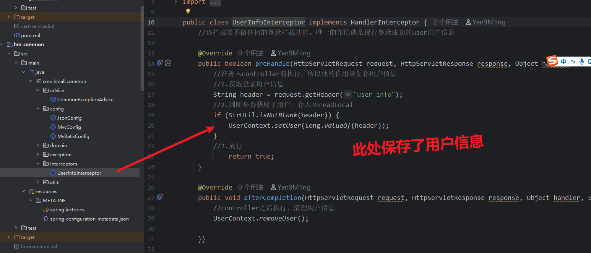

那么这样的话，就需要从请求头中取到user-info这个登录信息。 网关向购物车发送的请求中带着user-info的信息， 所以能够取到用户信息，但是如果是从交易服务传递过去的，那么该请求中就不会携带用户的信息；


添加上OpenFeign拦截器后：

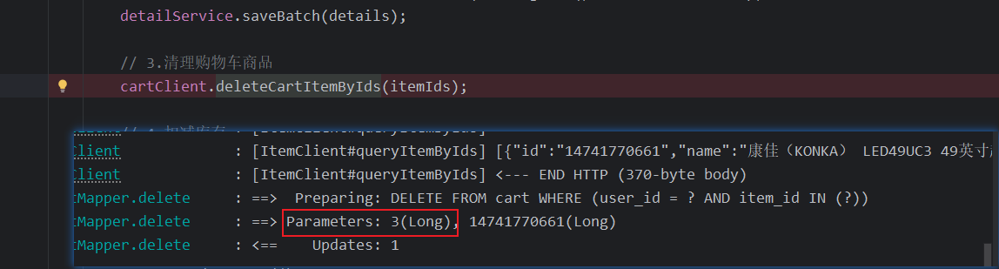

### 网关 过滤器+拦截器

#### AuthLoginGloableFilter 网关过滤器

作用：将传递到网关的请求做过滤，白名单放行，黑名单需要检验是否存在登录信息

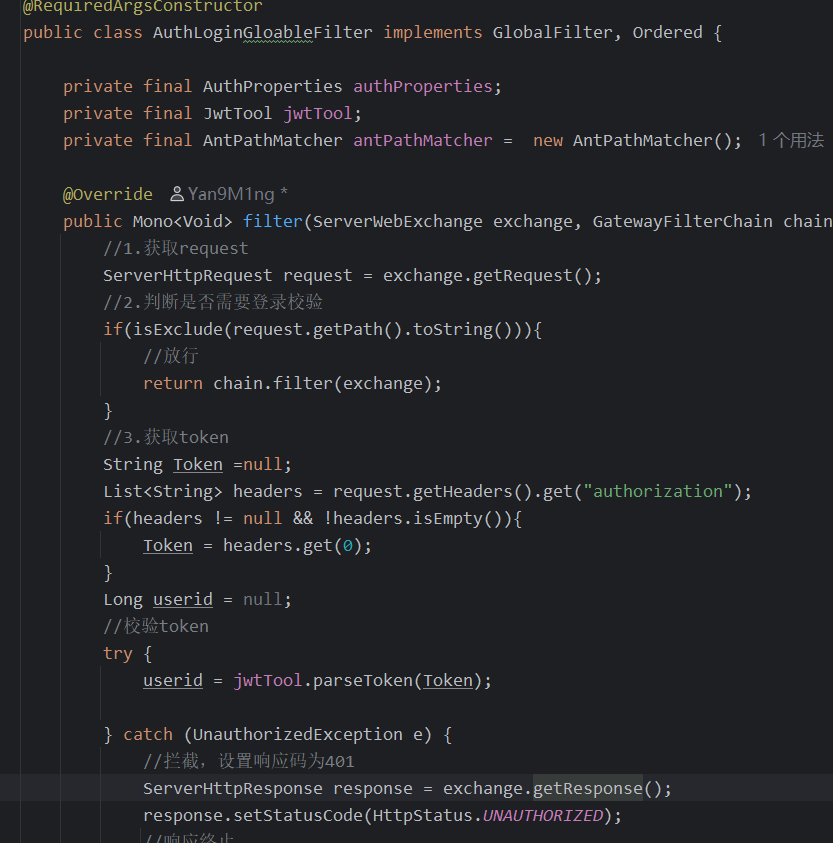

#### UserInfoInterceptor common拦截器

@Component注解：这个注解将您的过滤器类声明为一个Spring Bean。Spring Cloud Gateway在启动时，会自动扫描并加载所有实现了 GlobalFilter接口的Bean，将它们纳入全局过滤器链中。
GlobalFilter接口：实现这个接口就意味着该过滤器的逻辑会作用于所有路由（Route），与路由的具体配置无关，是一种“全局”拦截机制。

作用是：从请求头中获取用户信息，保存在UserContext中

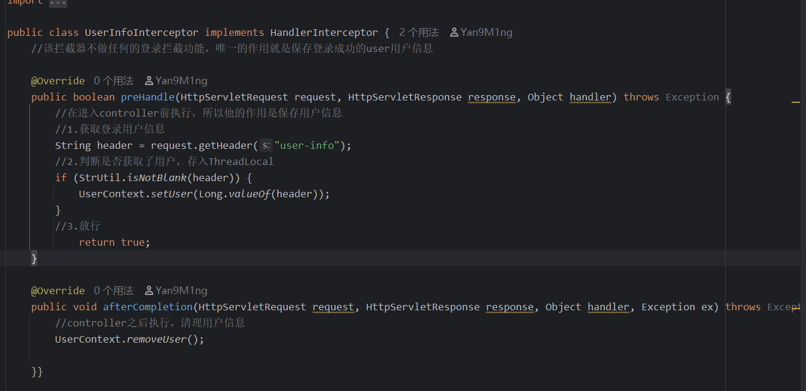

该请求会被MvcConfig配置类注册到springmvc拦截器链中，没有拦截任何请求

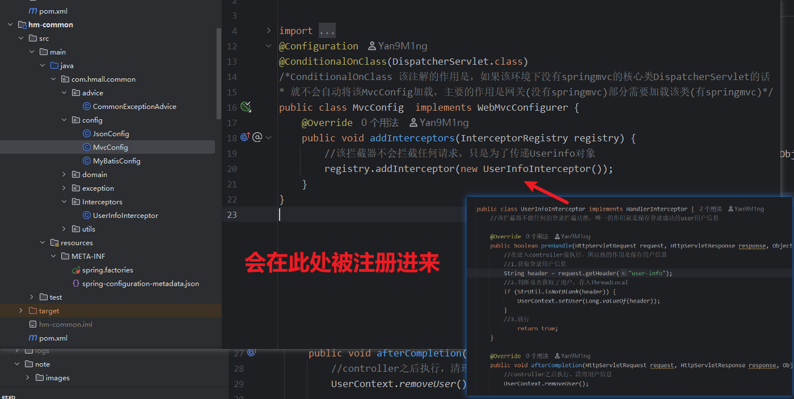

#### DefaultFeignConfig  拦截器

只要使用 Feign 调用其他微服务，这个拦截器就会执行一次，这是一个 Feign 请求拦截器，用于在微服务之间调用时，把当前请求线程中的用户 ID 透传到下游服务的请求头中，与 MVC 的 `UserInfoInterceptor` 配合，实现全链路用户上下文传递。

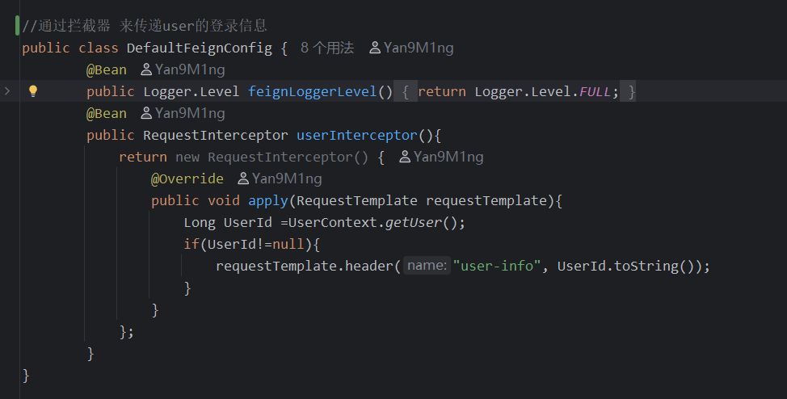

# 配置管理

​	1.微服务项目有很多微服务，这些微服务中有很多共用的配置如:mysql数据库，日志，swagger文档等，如果做修改维护起来会比较麻烦，配置管理服务可以来管理这些共用的配置。

​	2.业务配置变动，需要经常重启服务

​	3.网关路由配置写死，如果变更需要重启网关

配置管理服务则会监听配置变更，然后推送配置变更到网关或者微服务，这样网关微服务不需要重启，实现了热更新；

## nacos配置共享

>  将一些共享的配置添加在nacos的配置列表中：jdbc,MybatisPlus,日志，swagger,OpneFeign

 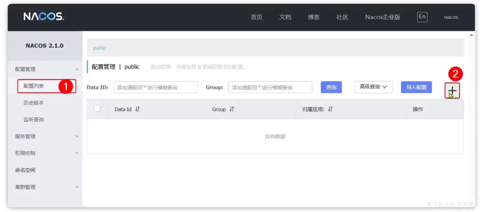

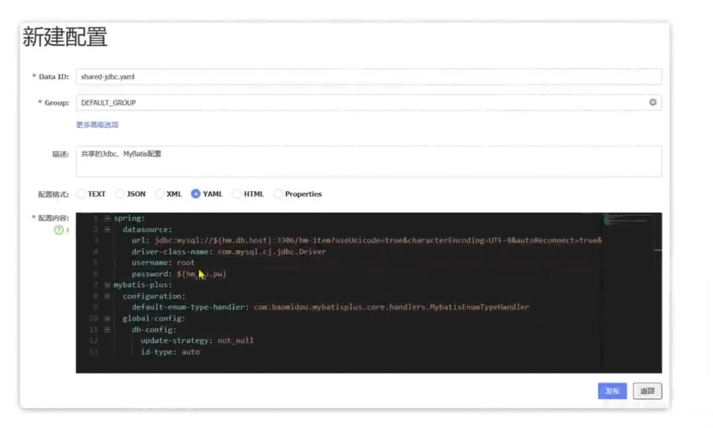

### Mybatis，jdbc配置

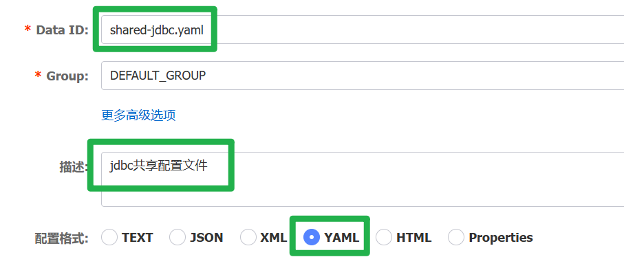

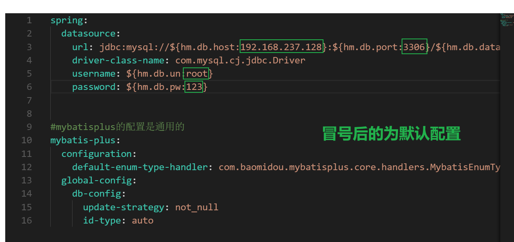

### 日志

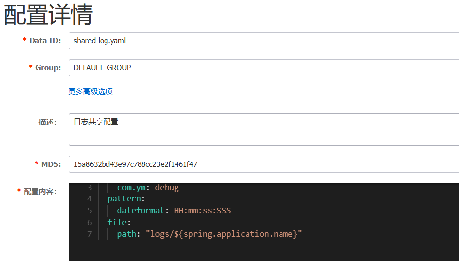

### swagger配置


## nacos拉取服务

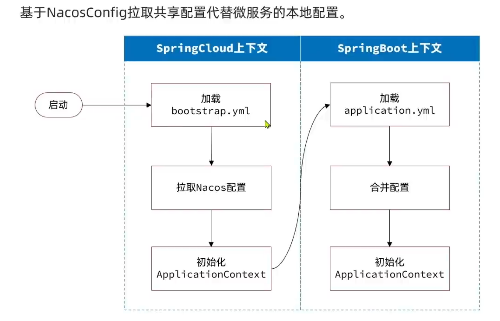

步骤：

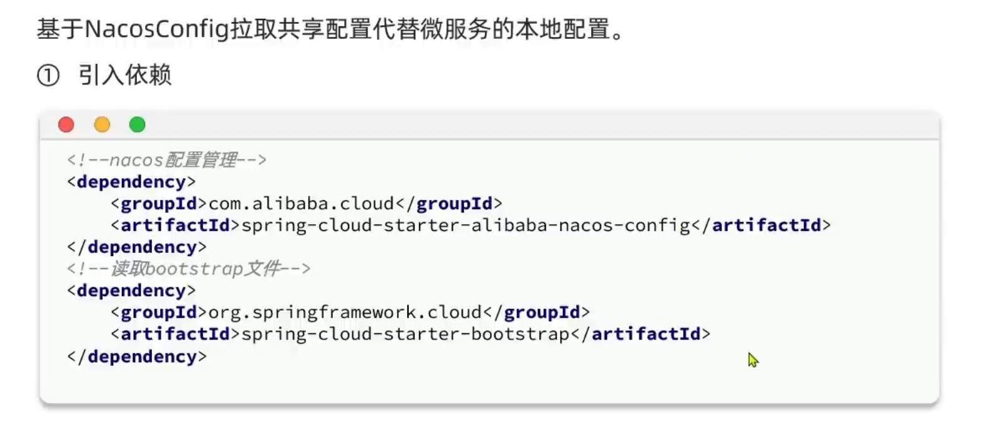

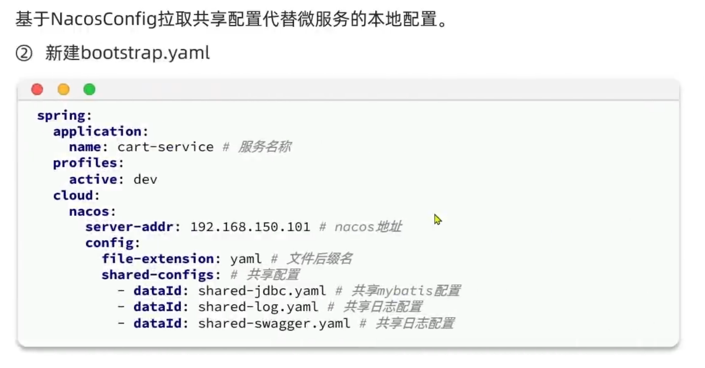

tg调研 在密码方面面向大众服务，类似于tg的本地化，核心是面向大众，其他公司的 手机上的秘钥存在哪里，mg存在哪里，想要做这些，需要什么资源
