# nacos服务发现

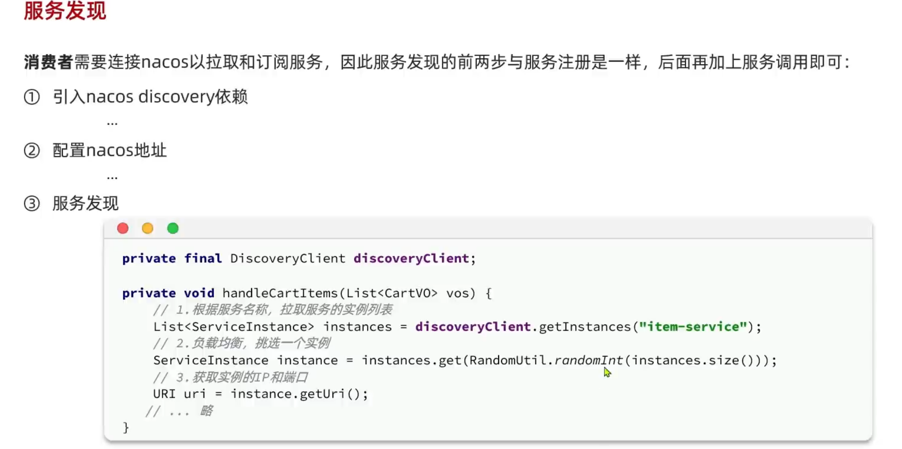

## http远程调用

原先的远程http请求调用代码:

```java
 Set<Long> itemIds = vos.stream().map(CartVO::getItemId).collect(Collectors.toSet());
        // 2.查询商品
        //利用RestTemplate发起http请求，得到http的响应
        ResponseEntity<List<ItemDTO>> response = restTemplate.exchange(
                "http://localhost:8081/items?ids={ids}",
                HttpMethod.GET,
                null,
                new ParameterizedTypeReference<List<ItemDTO>>() {},
                Map.of("ids", CollUtil.join(itemIds, ","))
        );
        //这里的http请求使用的是硬编码，之后万一有更多的购物车服务的话，
        // 此处无法完成服务的正常使用，此时就需要使用到注册中心！！
        //解析响应
        if(!response.getStatusCode().is2xxSuccessful()){
            //查询失败，直接结束
            return;
        }
        List<ItemDTO> items = response.getBody();
        if (CollUtils.isEmpty(items)) {
            return;
        }
```

## Nacos服务发现

利用nacos服务发现新代码：

```java
 // 1.获取商品id
        Set<Long> itemIds = vos.stream().map(CartVO::getItemId).collect(Collectors.toSet());
        //1.根据服务名称获取服务实例列表
        List<ServiceInstance> instances = discoveryClient.getInstances("item-service");
        if (CollUtils.isEmpty(instances)){
            return;
        }
        //2.负载均衡，从实例列表中挑选一个实例
        ServiceInstance serviceInstance = instances.get(RandomUtil.randomInt(instances.size()));
        //3.利用RestTemplate发起Http请求，得到http响应
        ResponseEntity<List<ItemDTO>> response = restTemplate.exchange(
                serviceInstance.getUri()+"items?ids={ids}",
                HttpMethod.GET,
                null,
                new ParameterizedTypeReference<List<ItemDTO>>() {},
                Map.of("ids", CollUtil.join(itemIds, ","))
        );
        if(!response.getStatusCode().is2xxSuccessful()){
            //查询失败，直接结束
            return;
        }
        List<ItemDTO> items = response.getBody();
        if (CollUtils.isEmpty(items)) {
            return;
        }
```

****

# OpenFeign


由于服务发现中的Http代码较多，使用nacos和之前没有进行服务拆分的代码相比代码复杂了很多。

## 简介

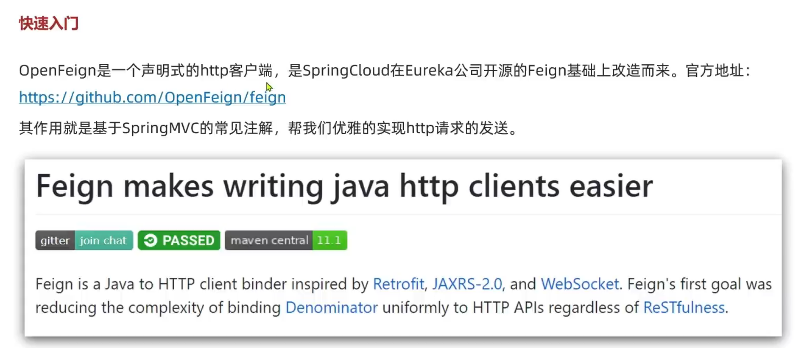

原本的代码的主要功能：

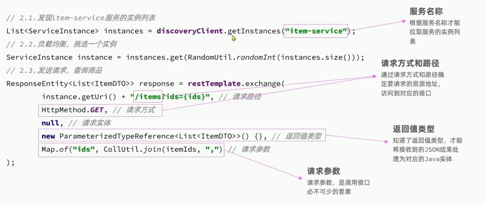

## 入门

 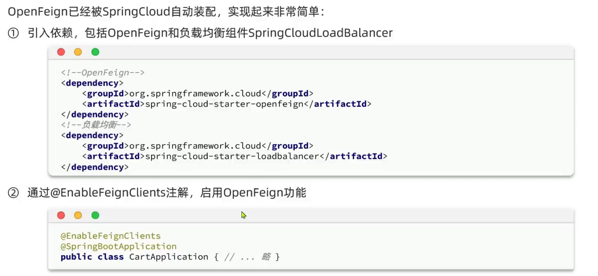

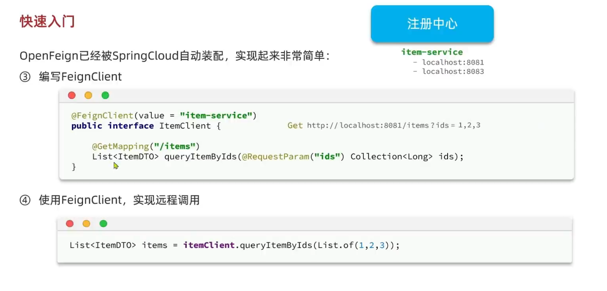

1.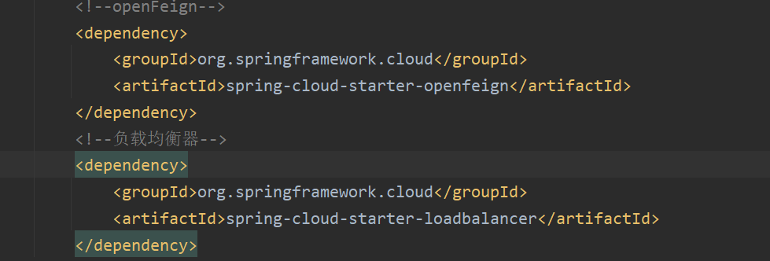

2.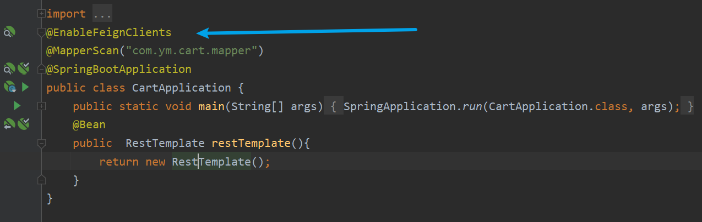

3.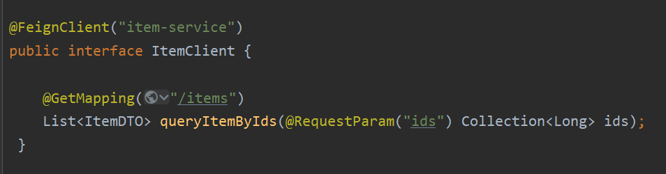

4.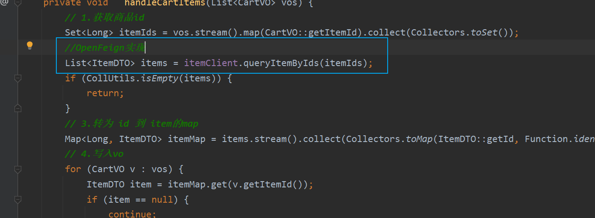

## 连接池优化

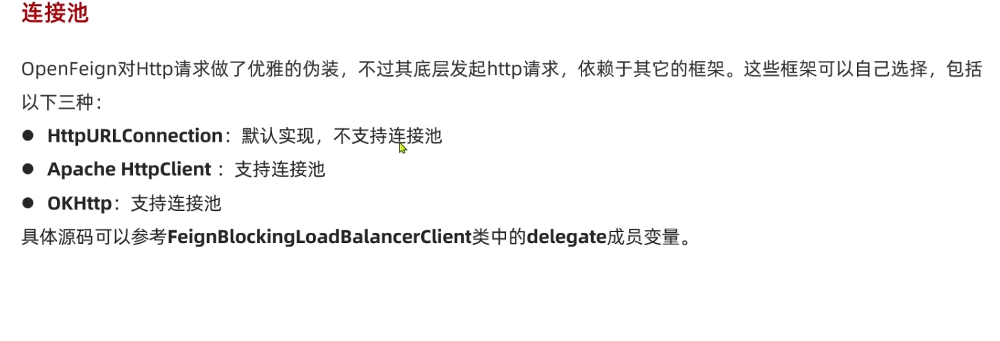

开启步骤

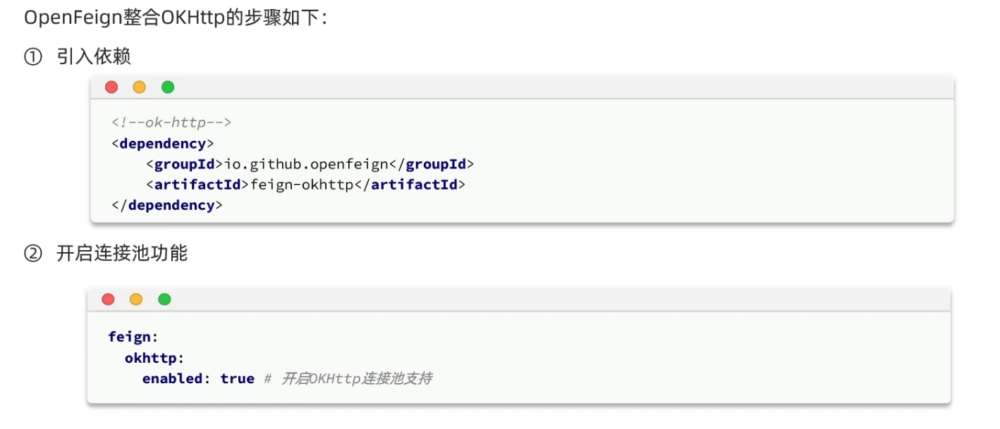

## Feign最佳实践

在添加商品到购物车中的功能中需要使用到查询商品功能，当时定义了一个OpenFeign的接口，在订单创建时也会使用到查询商品功能，就还需要再重复的定义一个查询商品的OpenFeign接口吗？

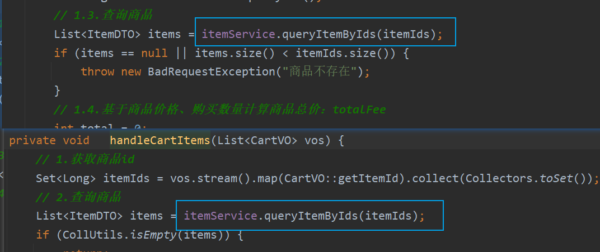

此时有了代码的重复的问题，后续还需要重复修改

方案一：

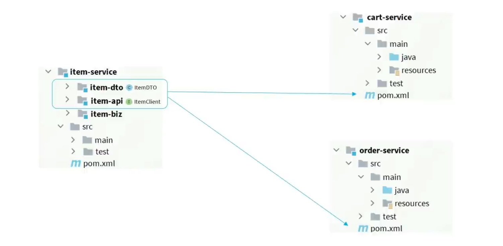

项目结构复杂。

方案二：

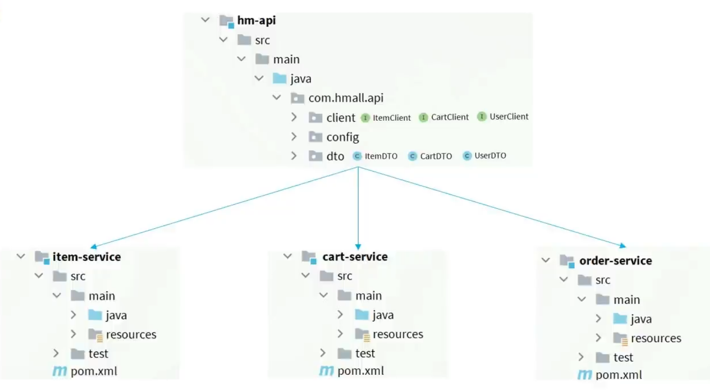

耦合度比较高。

这里演示第二种

CartApplication启动类所在的包是spring自动扫描的地方(com.ym.cart)，所以尽管pom中添加了client的依赖，但是spring无法创建client的实例，因为扫描的范围只有启动类所在的位置。

注意:

> 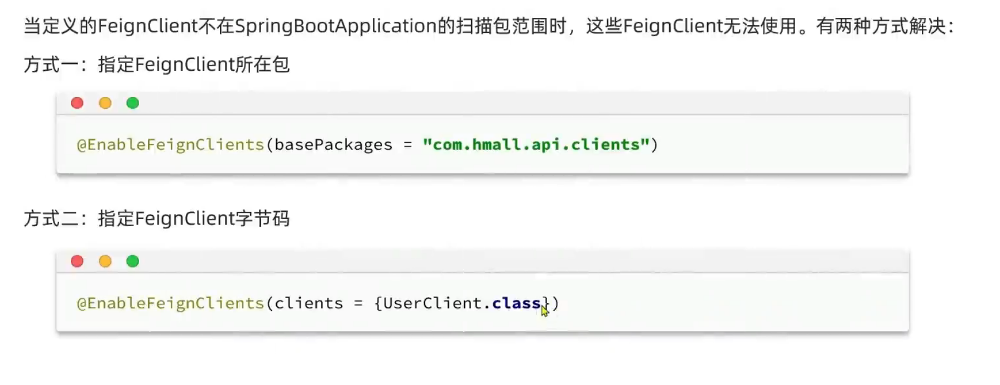

## 日志输出

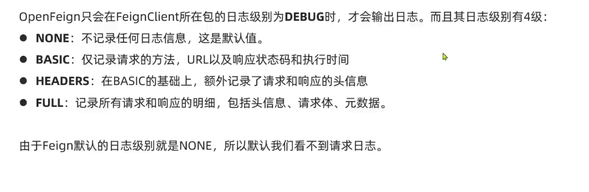


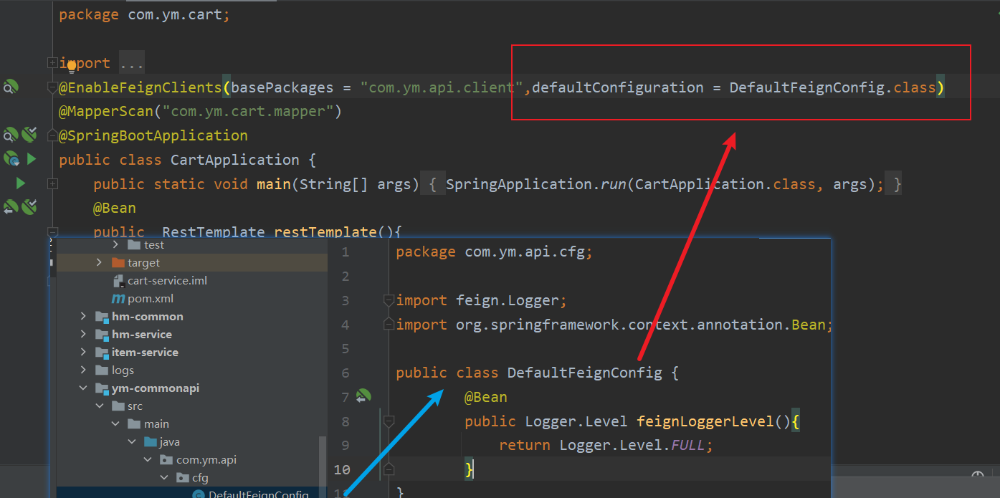

# 网关

拆分微服务带来的问题：

> 1.服务地址过多，而且后期可能发生变化，前端不知道访问谁;
>
> 2.每个服务都需要登录信息，如果每个服务中添加的话就会导致代码冗余;

解决方案：
网关：是网络的关口，负责请求的路由，转发，身份校验 

使用的是springcloud的 spring cloud gateway

## 入门

>1.创建新模块
>
>2.引入网关依赖
>
>3.编写启动类
>
>4.配置路由规则

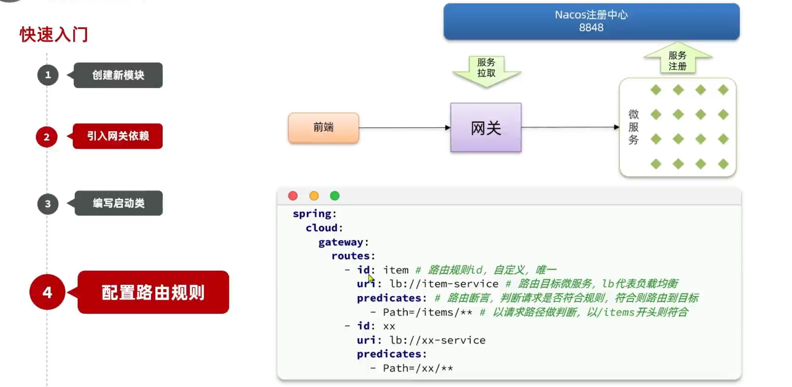

## 路由属性

路由断言

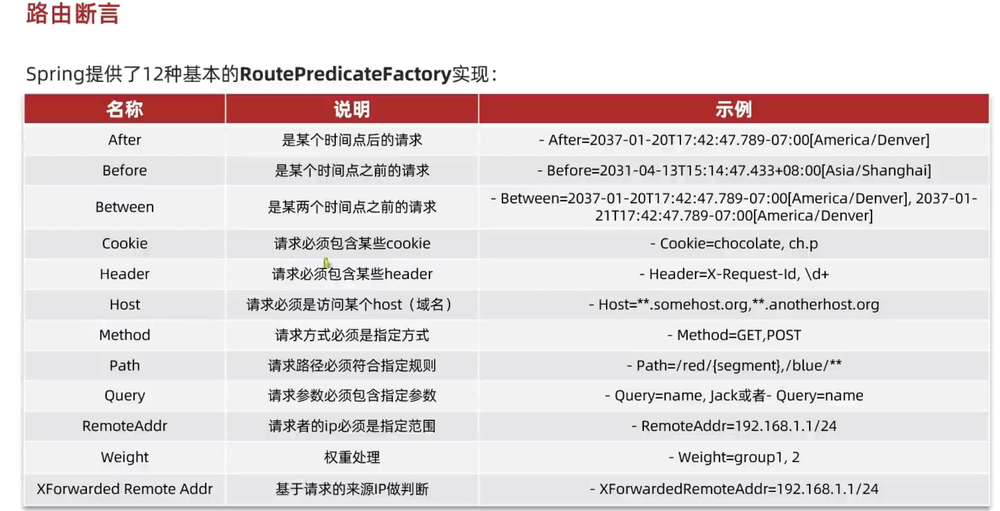

路由过滤器

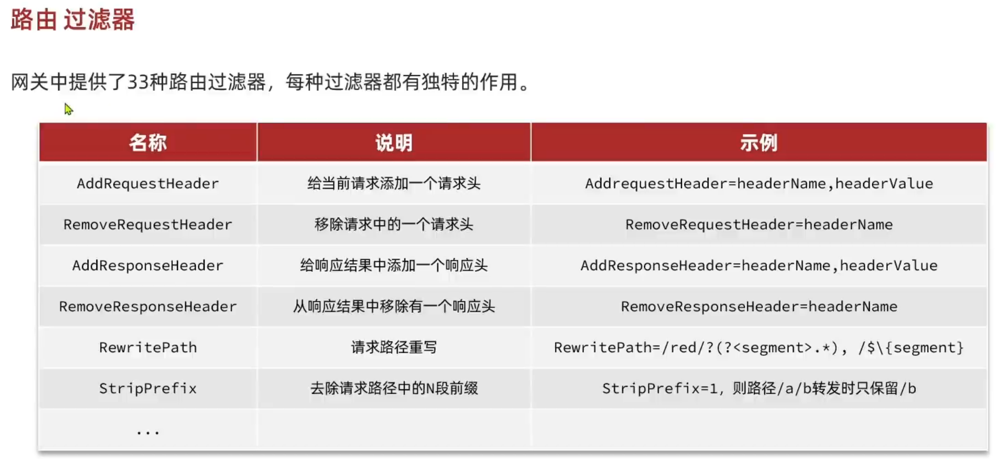

例子：添加请求头过滤器

```F#
    gateway:
      routes:
        - id: item # 路由规则id，自定义，唯一
          uri: lb://item-service # 路由的目标服务，lb代表负载均衡，会从注册中心拉取服务列表
          predicates: # 路由断言，判断当前请求是否符合当前规则，符合则路由到目标服务
            - Path=/items/**,/search/** # 这里是以请求路径作为判断规则
          filters:
            - AddRequestHeader= truth, anyone long-press like button will rich
```

```java
    @ApiOperation("分页查询商品")
    @GetMapping("/page")
    public PageDTO<ItemDTO> queryItemByPage(PageQuery query,@RequestHeader(value = "truth" , required = false)String truth) {
        System.out.println(truth);
        // 1.分页查询
        Page<Item> result = itemService.page(query.toMpPage("update_time", false));
        // 2.封装并返回
        return PageDTO.of(result, ItemDTO.class);
    }
```

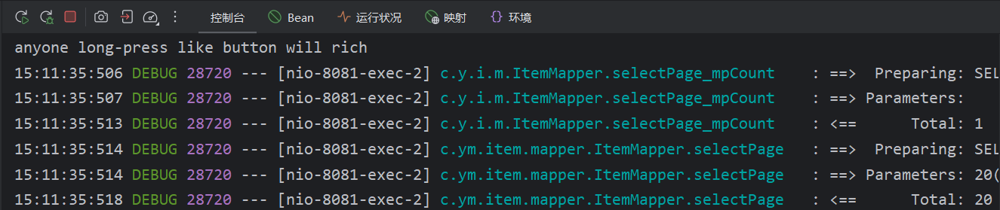

控制台将添加的请求头打印，如果需要每个路由都生效该过滤器，则将该过滤器添加到route同级的标签下

```javascript
spring:
  application:
    name: gateway
  cloud:
    nacos:
      server-addr: 192.168.237.128:8848
    gateway:
      routes(5):
      default-filters:
        - AddRequestHeader= truth, anyone long-press like button will rich
```

## 登录校验功能

​	首先登录授权微服务通过jwt的方式将用户的token保存到前端，别的微服务如订单和购物车都需要获取该token，不希望将jwt秘钥传递给这些微服务，现在通过网关来进行登录校验！向后传递登录token。

 网关处理流程：

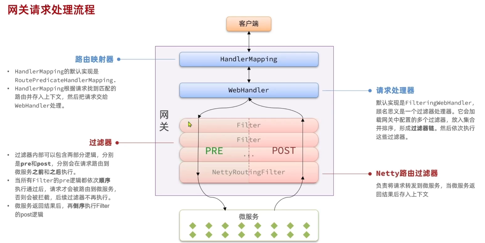

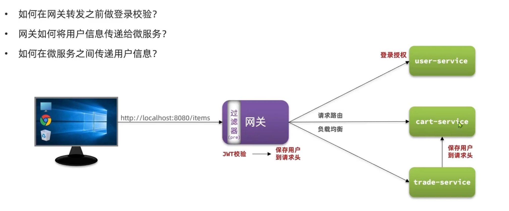

### 自定义过滤器 (GloableFilter)

​	将自定义过滤器作为判断用户身份的功能，并且保证该过滤器在NettyRoutingFilter之前执行，就能确保在转发路由请求前登录校验。

1.创建自己的过滤器

```java
@Component
public class MyGlobalFilter  implements GlobalFilter{
    @Override
    public Mono<Void> filter(ServerWebExchange exchange, GatewayFilterChain chain) {
        //TODO 模拟登录校验逻辑
        ServerHttpRequest request = exchange.getRequest();
        HttpHeaders headers = request.getHeaders();
        System.out.println("headers"+headers);
        //放行
        return chain.filter(exchange);
    }
}
```

2.设置过滤器优先级

```SAS
通过实现的Ordered的类的getOrder方法，该方法返回的数字越小，优先级越大，如 NettyRoutingFilter的优先级为：
```

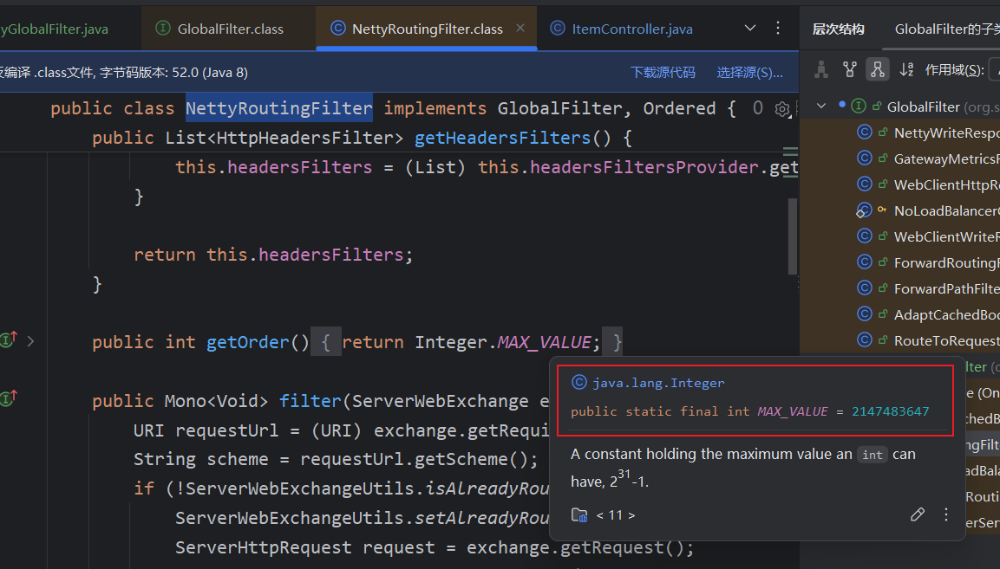

在debug模式下先进入了Gloable中：

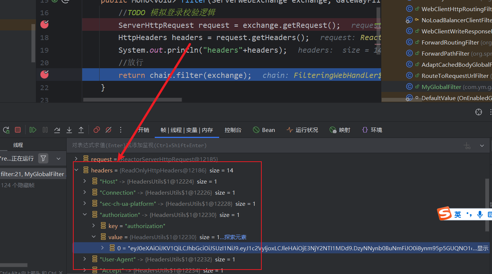

### 自定义过滤器(GatewayFilter)

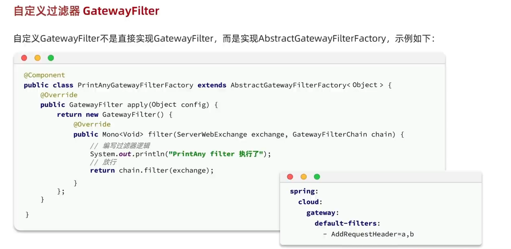

此处跳过

### 实现登录校验（GloableFilter）

需求：在网关中基于过滤器实现登录校验功能

hmall 更改！
```
通过继承GloableFilter，Ordered实现，AuthLoginGloableFilter
代码:AuthLoginGloableFilter.java
```

### 实现登录用户信息传递功能

```
//todo 传递用户信息
String userInfo = userid.toString();
exchange.mutate()
        .request(builder->builder.header("user-info",userInfo))
        .build();
```

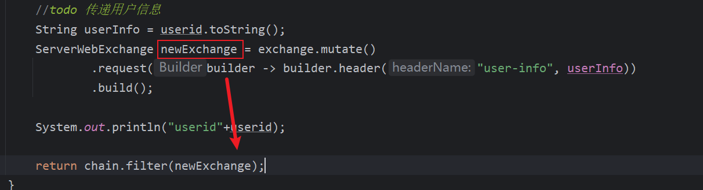

注意需要传递给下一个过滤器。

hmall修改